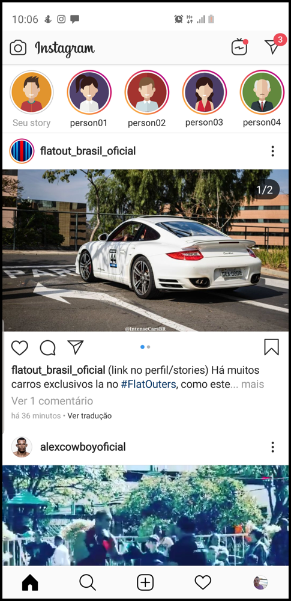

# Flutter Dojo 01

A partir do que foi apresentado nos primeiros encontros, o desafio era replicar a tela do Instagram, com objetivo de praticar e reforçar alguns conceitos básicos.

## Resultado

| Original                         | Resultado                           | 
| ---------------------------------|:-----------------------------------:| 
|  |       |

## Links
[Evento realizado](https://www.meetup.com/pt-BR/FlutterDevPoa/events/264370004/)

